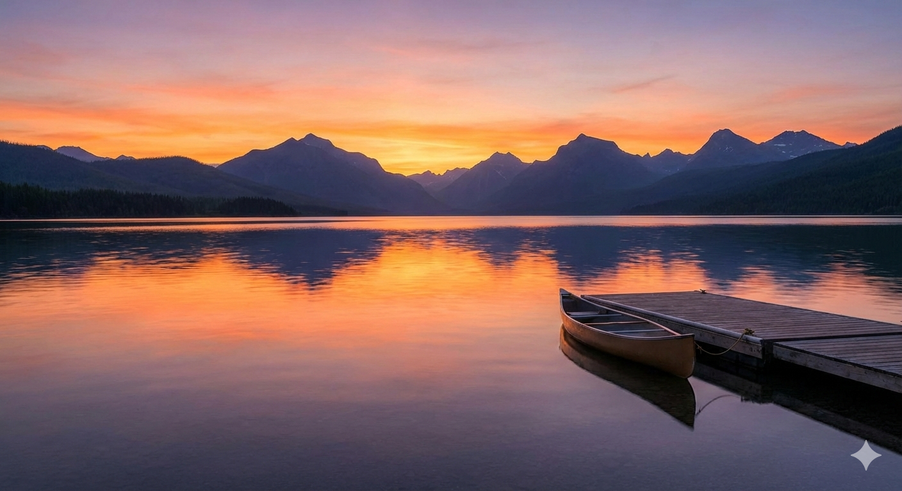
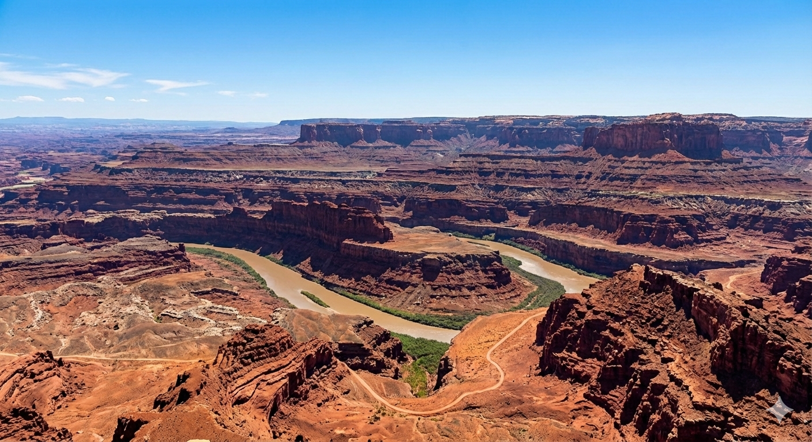
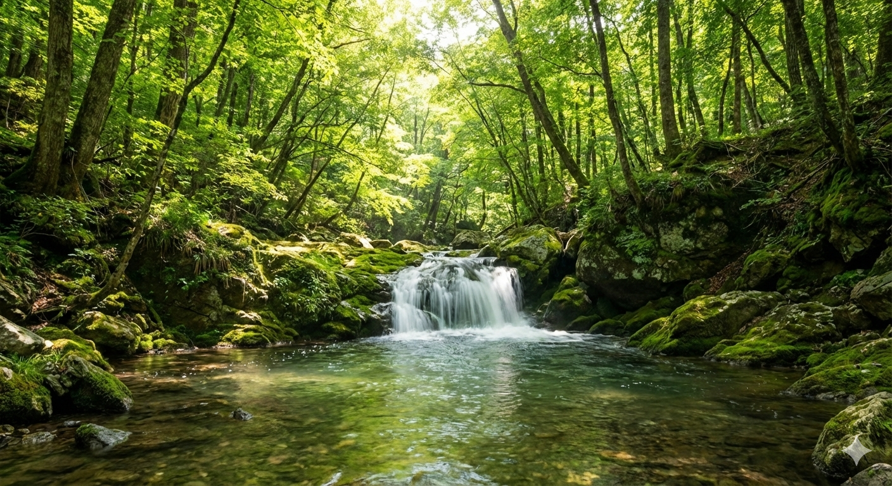

# 🌅 1. Lago

**Licencia:** `CC BY` (Atribución)
> Cualquiera puede usar, modificar y vender esta imagen, siempre que me dé crédito.

---

# 🌵 2. Gran cañón

**Licencia:** `CC BY-NC` (Atribución - No Comercial)
> Puedes compartir y modificar esta imagen, pero **no puedes ganar dinero** con ella.

---

# 🌿 3. Río

**Licencia:** `CC BY-NC-ND` (Atribución - No Comercial - Sin Derivadas)
> Es la más restrictiva. Puedes compartirla, pero **no puedes cambiarla ni venderla**.

